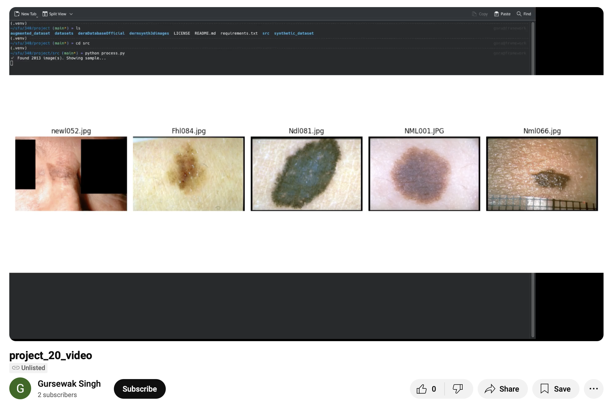

[](https://github.com/sfu-cmpt340/2025_1_project_20?tab=AGPL-3.0-1-ov-file#)
[](https://www.youtube.com/watch?v=tvr8eKKy2vw)


# Interactive Generation of DermSynth3D Data

This repository contains the complete pipeline for generating, training, and evaluating synthetic dermatology images using deep learning and statistical methods. Our project, **DermSynth3D**, addresses the challenges of limited dermatology datasets by focusing on class balancing through synthetic image generation.

---

## 🧠 Acronym: DermSynth3D
**Dermatology Synthetic 3D** – A pipeline that synthesizes realistic dermatology images for weak classes and evaluates their utility through classification and quality metrics. This project combines synthetic image generation, classical ML training, PCA visualization, and FID-based evaluation for a complete pipeline in dermatological AI.

---
<!-- table of contents-->
## 📚 Table of Contents
- [💡 Motivation](#-motivation)
- [🔗 Important Links](#-important-links)
- [📽️ Demo Video](#-demo)
- [📁 Directory Structure](#-directory-structure)
- [⚙️ Installation](#-installation)
- [🔄 Reproducing the Project](#-reproducing-the-project)
- [📊 Outputs Brief Summary](#-outputs-brief-summary)
- [🚀 Future Enhancements](#-future-enhancements)
- [✅ Status: Complete](#-status-complete)
- [📕 Cite](#-cite)
- [🔗 Important References](#-references)

## 💡 Motivation
Medical image datasets often suffer from:
- **Limited data** for rare skin conditions
- **Severe class imbalance** in disease types
- **Privacy constraints** making real data hard to collect

This project uses synthetic generation to:
- Expand weak class samples
- Maintain realistic features
- Improve classifier generalization
- Enable experimentation without data privacy concerns

---

## 🔗 Important Links

| Resource         | Link                                                                 |
|------------------|----------------------------------------------------------------------|
| Timesheet        | [Timesheet](https://1sfu-my.sharepoint.com/:x:/g/personal/hamarneh_sfu_ca/EQVnMvkVw5NBqdqjeR0Sy2sBDikpXcyxfIWPbuRUXovYVg?e=af9bcT) |
| Slack Channel    | [Slack](https://cmpt340spring2025.slack.com/archives/C0877AZ4ASW)    |
| Project Report   | [Overleaf Report](https://www.overleaf.com/4416194535yqcgjwkxtbny#ada67e) |

---

## 📽️ Demo
A walkthrough demo video of the full DermSynth3D pipeline including synthetic generation, training, and evaluation (shared separately with submission).

[](https://www.youtube.com/watch?v=tvr8eKKy2vw)
[](https://www.youtube.com/watch?v=tvr8eKKy2vw)

---

## 📁 Directory Structure
```
2025_1_PROJECT_20/
├── augmented_dataset/                 # Holds post-processed augmented images
├── augmented_images/                 # Holds image augmentations applied
├── data/blending/data/DermSynth3D/  # Blending-related data (unused in current pipeline)
├── datasets/                         # (Optional) legacy data holder
├── dermDatabaseOfficial/            # Original derm database
│   └── release_v0/images/           # Raw derm image folders by class
├── dermsynth3dimages/               # Older synthesis experiments
├── synthetic_dataset/               # Output of generate_synthetic.py (new synthetic imgs)
├── outputs/                         # Results, logs, eval images, PCA plots
├── src/
│   ├── amazing/                     # Placeholder module (template/example)
│   ├── train_feature/
│   │   ├── generate_synthetic.py       # Generates synthetic images for weak classes
│   │   ├── train_features.py           # Trains classifier on extracted features
│   │   ├── train_combined_features.py # Trains classifier on real+synthetic features
│   │   ├── pca_visualization.py       #  Visualizes PCA clusters
│   ├── augment.py                   # Legacy script for image augmentation
│   ├── check_images.py              # Utility to preview loaded images
│   ├── evaluate_quality.py          #  Orchestrator to compute FID/SSIM
│   ├── evaluate.py                  # Implements FID + SSIM logic
│   ├── feature_extraction.py        #  Extracts ResNet18 features, saves CSV
│   ├── process.py                   # Loads and previews raw images
│   ├── visual_feature.py            # (Optional) legacy visualizer
│   ├── run.py                       #  Runs entire pipeline from generation to evaluation
│   ├── synthetic_features.csv       #  Feature CSV from synthetic images
│   ├── extracted_features_with_labels.csv # Feature CSV from real images
├── requirements.yml                 # Conda env definition
├── LICENSE
├── README.md                        # Current markdown project summary
```

---

## ⚙️ Installation

### Pre-requisites

[](https://git-scm.com/book/en/v2/Getting-Started-Installing-Git)
[](https://www.python.org/downloads/)
```bash
git clone https://github.com/sfu-cmpt340/2025_1_project_20.git
cd 2025_1_project_20

# create a python virtual environment
python -m venv .venv

# activate the virtual environment
source .venv/bin/activate
```

### Python Packages
All the required packages are listed in `requirements.txt`. You can install them using pip: <br>
```bash
# install the requirements
pip install -r requirements.txt
```
Ensure Python ≥ 3.10 and PyTorch ≥ 2.0.

---

## 🔄 Reproducing the Project
```bash
cd src/

# [1] Generate synthetic images
python train_feature/generate_synthetic.py

# [2] Extract features
python feature_extraction.py

# [3] Train classifier
python train_feature/train_combined_features.py

# [4] Visualize PCA
python train_feature/pca_visualization.py

# [5] Evaluate image quality
python evaluate_quality.py
```

Or run everything at once:
```bash
python run.py
```

---

## 📊 Outputs Brief Summary

### Classification Performance
| Experiment        | Accuracy | FID Score |
|------------------|----------|-----------|
| Real Only        | ~76%     | —         |
| Synthetic Only   | ~90%     | 131.19    |
| Combined         | **94.12%**| —         |

**Observation**: Synthetic images improved weak class performance and RandomForestClassifier gave solid performance for feature-based data

### Classification Report
| Class | Precision | Recall | F1-Score | Support |
|-------|-----------|--------|----------|---------|
| Fml   | 1.00      | 0.94   | 0.97     | 31      |
| Gbl   | 0.97      | 1.00   | 0.98     | 28      |
| Gcl   | 0.95      | 0.97   | 0.96     | 38      |
| Gdl   | 0.90      | 0.92   | 0.91     | 38      |
| NHL   | 0.97      | 0.94   | 0.96     | 35      |
|       |           |        |          |         |
| **Accuracy**    |           |        | **0.95** | **170** |
| **Macro Avg**   | 0.96      | 0.95   | 0.96     | 170     |
| **Weighted Avg**| 0.95      | 0.95   | 0.95     | 170     |

**Observation**: High accuracy across all classes, especially for synthetic images.

### Confusion Matrix


**Observation**: The confusion matrix highlights high classification accuracy across all classes, with minimal confusion between similar categories, confirming that synthetic data effectively improved model performance and addressed class imbalance.


### PCA Visualization1


**Observation**: The PCA plot reveals clear clustering for classes like ‘Fml’, while overlap between ‘Gbl’ and ‘Gdl’, etc. suggests shared visual features or embeddings in the feature space.

### PCA Visualization2


**Observation**: The PCA plot shows strong overlap between real and synthetic data distributions, confirming that the synthetic images successfully mimic real feature characteristics, validating the augmentation strategy.

### FID Evaluation
113.19

**Observation**: FID score ≈120–130 showed high-quality synthesis

> SSIM was skipped due to dimensional mismatch errors. FID was the main quality metric.

---

---

## 🚀 Future Enhancements
- Try GANs or diffusion models for more realistic generation
- Use smart or conditional augmentations
- Extend to other medical imaging modalities
- Build a web-based tool for interactive class augmentation

---

## ✅ Status: Complete
- Fully working synthesis + training pipeline
- High accuracy with synthetic data
- Evaluated with PCA + FID
- One-click automation via `run.py`

---

## 📕 Cite
If using our work, please cite:
```bibtex
@misc{DermSynth3D,
  author = {Aryaman Bahuguna, Gursewak Singh, Agraj Vuppula, Mohammed Ashraful Islam Bhuiyan, Mouryan Puri},
  title = {DermSynth3D: Interactive Generation of Dermatology Images for Class Imbalance Mitigation},
  year = {2025},
  publisher = {GitHub},
  url = {https://github.com/sfu-cmpt340/2025_1_project_20},
}

@misc{originalDermSynth3D,
  author = {SFU Medical Image Analysis Lab (MIAL)},
  title = {DermSynth3D: Synthetic Dermatology Image Generation},
  year = {2023},
  publisher = {GitHub},
  url = {https://github.com/sfu-mial/DermSynth3D},
}
```
---

## 🔗 Important References
(for complete list of references, please refer to the project report)

1. **Derm7pt Dataset**  
   Kawahara, J., & Hamarneh, G. (2018). *Derm7pt: A dermatology dataset for 7-point checklist disease detection*. [https://derm.cs.sfu.ca/](https://derm.cs.sfu.ca/)

2. **Synthetic Image Generation**  
   Ghorbani, A. et al. (2020). *DermGAN: Synthetic Generation of Clinical Skin Images with Pathology*. NeurIPS ML4H Workshop.

3. **Fréchet Inception Distance (FID)**  
   Heusel, M. et al. (2017). *GANs trained by a two time-scale update rule converge to a local Nash equilibrium*. NeurIPS.

4. **Feature Extraction – ResNet-18**  
   He, K. et al. (2016). *Deep Residual Learning for Image Recognition*. CVPR.
